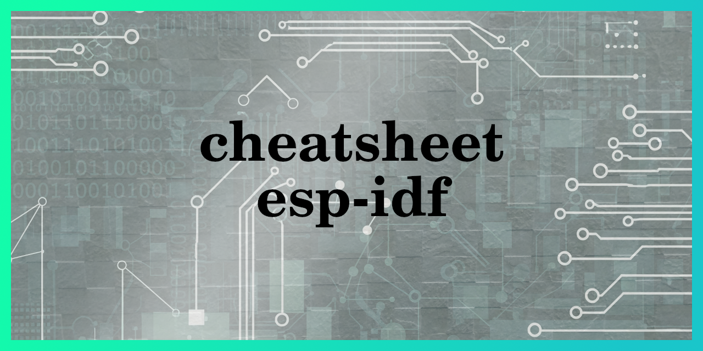

## DEVELOPMENT KITS
<table>
 <tr>
  <td>
   
   <br>
   ESP32-H2-DevKitM-1 <br> https://espressif-docs.readthedocs-hosted.com/projects/esp-dev-kits/en/latest/esp32h2/esp32-h2-devkitm-1/user_guide.html
  </td>
  <td>
   
   <br>
   ESP32-C6-DevKitC-1 v1.2 <br> https://espressif-docs.readthedocs-hosted.com/projects/esp-dev-kits/en/latest/esp32c6/esp32-c6-devkitc-1/user_guide.html
  </td>
 </tr>

</table>

## INSTALACION Y SELECCION DE VERSION

Busca la release que quieras instalar y clonala en un directorio indicando la version, es posible que mas adelante necesites una version especifica para algun codigo concreto. Normalmente puedes encontrar esta info en las primeras lineas del archivo sdkconfig del proyecto

```
mkdir esp
cd esp
git clone --recursive https://github.com/espressif/esp-idf.git -b release/v5.3 esp-idf-5.3
```

Una vez tengas clonado el repositorio instalalo en tu equipo:
```
cd esp-idf-5.3
./install.sh
```

Cuando necesites que tu terminal use esp-idf con tu version especifica lanza export:
```
cd ~/esp/esp-idf-5.3/
. ./export.sh
```

Si necesitas otra version, lanza el export en el directorio de la version de idf adecuado.
```
idf.py --version
ESP-IDF v5.3.3-927-gbf79937908
```

## CREAR NUEVO PROYECTO
Lanza el export que consideres adecuado, generalmente la ultima version:
```
. $HOME/esp/esp-idf-5.4/export.sh
```

Copia un proyecto de ejemplo en la ruta que consideres:
```
cp -r $IDF_PATH/examples/get-started/hello_world/* ./mi_nuevo_proyecto
cd mi_nuevo_proyecto
```

Seleccionar el tipo de chip:
```
idf.py set-target esp32-h2       # O esp32s3, esp32c3, etc.
```

Ajusta configuracion del chip
```
idf.py menuconfig
```

Cambia el nombre de proyecto en CMakeList.txt en raiz de proyecto
```
project(hello_world)
```

## MODO MONITOR

Este modo reinicia el chip y muestra el debug. Para salir del modo monitor pulsa ctrl+]
```
idf.py -p /dev/ttyACM0 monitor
```

## MODO BUILD MONITOR
Este modo reinicia y carga el nuevo firmware. Para salir del modo monitor pulsa ctrl+]
```
idf.py -p /dev/ttyACM0 build monitor
```

## MODO BUILD FLASH MONITOR
Este modo reinicia, borra la memoria flash y carga el nuevo firmware. Para salir del modo monitor pulsa ctrl+]
```
idf.py -p /dev/ttyACM0 build flash monitor
```

## CLEAN
```
idf.py clean
```
Cuando compilas ESP-IDF crea un directorio llamado build/ dentro de la raíz de tu proyecto. Este directorio contiene: archivos objeto (.o), bibliotecas estáticas (.a), archivos ejecutables (.elf), archivos de caché de CMake, archivos de registro (logs) y Otros archivos intermedios.

idf.py clean se encarga de eliminar la mayoría de estos archivos generados dentro del directorio build/.

## MENSAJES DE LOG

```
I (188) app_init: Project name:     hello_world
```
Nombre de proyecto, cambialo desde CMakeList.txt en raiz de proyecto

```
I (193) app_init: App version:      844901e-dirty
```
Indica la versión de tu aplicación que se está ejecutando. Este formato de versión es muy común en proyectos que usan Git (el sistema de control de versiones) para gestionar su código, como es el caso de los proyectos ESP-IDF.

 - 844901e: Esta parte es un hash corto de Git. Representa el identificador único del commit (o "instantánea" del código) que se usó para construir tu firmware. Es una forma de saber exactamente qué versión de tu código fuente se compiló y se cargó en tu ESP.

 - dirty: Este sufijo es crucial. Indica que tu repositorio de Git no estaba "limpio" cuando se compiló el firmware. Un repositorio "sucio" significa que había cambios locales sin confirmar (sin git commit) en tus archivos cuando compilaste el proyecto.

```
I (210) app_init: ESP-IDF:          v5.4-dev-3489-g6e5a178b31
```
versión de ESP-IDF con la que fue compilada tu aplicación

```
W (259) spi_flash: Detected size(4096k) larger than the size in the binary image header(2048k). Using the size in the binary image header.
```
Tu ESP ha detectado físicamente que la memoria Flash conectada es de 4096 KB (4 MB). Esto es lo que el hardware ha leído del chip de memoria Flash, solucionalo con idf.py menuconfig


```
I (297) main_task: Calling app_main()
```
el sistema ha completado todas las inicializaciones de bajo nivel y ahora está a punto de llamar a tu aplicacion
